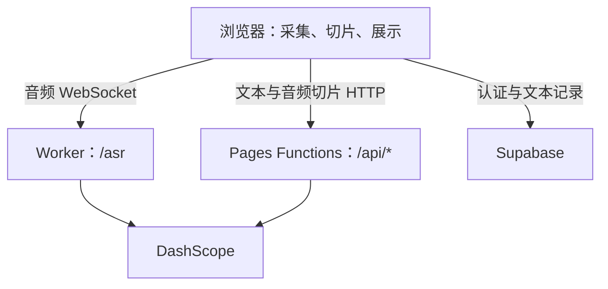

# ClassTrans Pro · 课堂实时转写、翻译与 AI 笔记

ClassTrans Pro 是面向英语课堂、网课与会议的 Web 应用。它支持从麦克风或浏览器共享音频实时转写，也支持导入已有录音；将英文整理为中英对照记录，经大模型润色、生成纪要后保存到个人文件夹，供回看、编辑和导出。

项目采用 **React + Supabase + Cloudflare Pages Functions / Worker + 阿里云百炼 DashScope**。音频采集、切片和界面更新在浏览器完成，模型请求经服务端代理，账号与文本记录保存在 Supabase。

> 本文以当前源码实现为准。默认实时链路为 **Paraformer 识别 → Qwen 翻译 / 润色**；仓库中仍保留 LiveTranslate 适配代码，但当前配置逻辑会将包含 `livetranslate` 的模型名归一化为 Paraformer，不能将其视为当前默认或可直接切换的功能。

## 功能概览

| 功能 | 当前实现 |
| --- | --- |
| 实时转写与翻译 | 麦克风、系统 / 标签页音频二选一；增量显示英文与中文，支持暂停、继续和停止后整理保存 |
| 音频文件转写 | 浏览器解码并切片，通过独立 HTTP 接口识别，再并发润色翻译、生成纪要并保存；显示处理阶段和进度 |
| AI 文本整理 | 修正英文转写、输出中文译文，按文本内容推断发言角色；支持重新润色和人工编辑 |
| 课堂纪要 | 基于会话文本生成核心主题、要点与总结；停止录音或完成文件转写时自动尝试生成 |
| 术语管理 | 云端保存个人纠错词对；进行识别后替换，并为 Paraformer 同步热词词表；文件转写携带术语上下文 |
| 记录与文件夹 | 保存中英转录及纪要，支持文件夹归档、搜索、重命名、移动和删除；会话详情按需读取 |
| 导出与阅读 | Word 兼容 `.doc` 导出、浏览器打印为 PDF、深浅主题；支持的浏览器可打开字幕悬浮窗 |
| 账号与配置 | 邮箱注册 / 登录、密码重置、个人资料与偏好设置；管理员界面配置各环节的全局模型 |
| 模型用量 | 在当前浏览器记录模型返回的文本调用 Token 用量，保留最近 200 条 |

使用时先登录并选择或新建文件夹，再开始录音或上传文件。文件转写要求先停止当前录音。系统 / 标签页模式需要在浏览器共享弹窗中选择带音频的来源并允许共享音频。

## 技术栈与组件职责

| 层次 | 技术与职责 |
| --- | --- |
| 前端 | React 19、React Router 7、Create React App（`react-scripts` 5）、lucide-react；Tailwind 通过 `public/index.html` 的 CDN 脚本加载，配合自定义 CSS |
| 浏览器音频 | Web Audio、AudioWorklet、`getUserMedia`、`getDisplayMedia`、`OfflineAudioContext` |
| 账号与数据 | Supabase Auth、PostgreSQL、RLS；前端通过 Supabase SDK 读写用户数据 |
| HTTP 后端 | Cloudflare Pages Functions：JWT 校验、模型 API 转发、SSE 流式响应、文件音频识别代理 |
| 实时语音中继 | 独立 Cloudflare Worker：WebSocket 转发、服务端注入 DashScope API Key、保活 |
| 模型服务 | DashScope 实时 ASR、音频文件 ASR，以及 OpenAI 兼容格式的 Qwen 文本接口 |



Worker 负责在服务端向 DashScope WebSocket 注入鉴权头，避免将 API Key 打包到前端。浏览器的数据库读写直接通过 Supabase SDK 完成。

## 两条处理链路

### 实时音频

1. **采集与识别**：选取麦克风或共享音频，经过 AudioWorklet 转换为 16 kHz、单声道、PCM16 音频，以 100 ms 帧经 `/asr` 中继送往 Paraformer。
2. **增量翻译**：根据识别文本的变化触发实时翻译；检查周期为 700 ms，并避免该循环重复发起尚未结束的请求。此处翻译为普通 JSON 响应，流式显示来自持续更新的识别文本。
3. **分段润色**：文本片段定稿后调用 `/api/polish`，通过 SSE 增量接收 `SPEAKER / EN / ZH` 文本字段，更新中英对照气泡。提示词携带最近最多 2 个已完成片段，用于术语和指代衔接。
4. **异常回退**：润色模型调用失败时，符合条件则尝试实时翻译模型；实时片段还具有基础翻译兜底及长度、中文占比等完整性检查。基础翻译按需启动，例如约 2.5 秒仍未收到首段中文时，不是每次都额外请求。
5. **停止与保存**：停止录音后等待正在处理的润色任务（等待上限约 3 分钟），再尝试生成纪要并保存会话。云端保存失败时，界面提示并将记录保留在当前页面内存中。

实时连接的公共逻辑封装在 [`BaseAsrSession`](src/baseAsrSession.js)：启动等待与重试、心跳、静音保活、停滞检测、主动续期、断线重连，以及最多约 15 秒的待发送音频缓冲。缓冲溢出会丢弃最早的帧，不能保证长时间断网后的音频完整性。

Worker 每 30 秒向浏览器发送心跳，并对 `/asr` 上游发送静音 PCM 帧；不会将浏览器的 JSON 心跳直接转发给语音模型。

### 音频文件

1. **本地解码**：浏览器将文件解码为 16 kHz 单声道 PCM。支持的格式取决于浏览器解码能力，例如可解码的 MP3、M4A、WAV。
2. **低能量位置切片**：在每段约 120–160 秒的区间内寻找能量最低的短帧作为切分位置，再编码为 WAV / Base64；尾片可以更短。
3. **并发识别**：通过 `/api/transcribe` 调用 `qwen3-asr-flash`，使用 3 个并发任务。单片失败后重试 1 次；仍失败时跳过并提示，连续失败计数达到 3 时中止任务。结果按原切片索引保存。
4. **文本整理**：按标点归组并跨切片携带未完成的句子，使用 4 个并发任务润色翻译；优先利用已完成的前置片段作为上下文。润色失败时尝试基础翻译，最终按原文顺序合并。
5. **纪要与归档**：自动尝试生成纪要并保存到当前文件夹。任务支持取消；已有处理结果时可停止并保存已完成片段，或在失败后保存部分结果。

原始文件不上传到对象存储，但切片音频会通过 Pages Functions 发送给 DashScope，因此文件转写需要联网。浏览器会先解码整个文件，长录音仍会占用较多内存。

以下数字均为**源码配置参数**，不是准确率、响应时间或负载测试结果：

| 参数 | 当前值 | 源码 |
| --- | --- | --- |
| 文件大小 / 时长限制 | 300 MiB / 3 小时 | [`audioFileTranscriber.js`](src/audioFileTranscriber.js) |
| 切片搜索区间 / 能量帧长度 | 120–160 秒 / 200 ms | [`audioFileTranscriber.js`](src/audioFileTranscriber.js) |
| 文件 ASR / 润色并发数 | 3 / 4 | [`App.js`](src/App.js) |
| 文件 ASR 服务端请求超时 | 120 秒 | [`transcribe.js`](functions/api/transcribe.js) |
| 实时连接自动重连次数 | 最多 3 次 | [`baseAsrSession.js`](src/baseAsrSession.js) |
| 实时任务主动续期间隔 | 14 分钟后择机续期，最多再延后 3 分钟 | [`baseAsrSession.js`](src/baseAsrSession.js) |

## 默认模型与全局设置

| 用途 | 源码默认值 | 配置位置 / `global_settings` 中的 `key` |
| --- | --- | --- |
| 实时语音识别 | `paraformer-realtime-v2` | `asr_model_name` |
| 实时 / 基础翻译 | `qwen-turbo` | `realtime_model_name` |
| AI 润色 | `qwen-plus` | `ai_model_name` |
| 课堂纪要 | `qwen-plus` | `summary_model_name` |
| 音频文件识别 | `qwen3-asr-flash` | `functions/api/transcribe.js` 的默认模型；当前前端未传入模型覆盖值 |

`global_settings` 是 `key / value` 结构。管理员界面通过 [`useGlobalSettings`](src/hooks/useGlobalSettings.js) 更新配置，应用读取云端值作为运行配置，并订阅该表的变更。上述值是源码默认值，实际部署可能已由管理员修改。

当前代码会迁移部分旧配置：润色 / 纪要中的 `qwen3.5-122b-a10b` 会被归一化为 `qwen-plus`，包含 `livetranslate` 的实时 ASR 配置会被归一化为 `paraformer-realtime-v2`。文件识别模型独立于实时 ASR 设置。

模型名称需要与所调用接口兼容；管理员输入一个名称，并不意味着对应模型一定支持当前协议。Paraformer 热词注册目前也以 `paraformer-realtime-v2` 为目标模型。

## API 与关键源码

| 接口 | 用途 |
| --- | --- |
| `POST /api/polish` | 文本模型代理；承载实时翻译及 SSE 润色 |
| `POST /api/summary` | 课堂纪要生成 |
| `POST /api/asr-vocabulary` | Paraformer 热词词表创建、更新、删除 |
| `POST /api/transcribe` | 音频切片识别，接收 Base64 音频及可选上下文 |
| `WS /asr` | Paraformer / Gummy `run-task` 协议中继；默认使用 Paraformer |
| `WS /realtime?model=...` | 保留的 Qwen Omni-Realtime 协议中继 |

`/api/*` 的上述 4 个 POST 接口均使用 [`_auth.js`](functions/api/_auth.js) 校验 Supabase Bearer JWT：支持通过 JWKS 验签的 ES256 / RS256，以及配置了密钥时的旧式 HS256。**独立 WebSocket Worker 当前只提供可选 Origin 白名单，没有复用这套用户 JWT 校验**；Origin 白名单不等同于用户身份认证。

| 路径 | 职责 |
| --- | --- |
| [`src/App.js`](src/App.js) | 主界面、实时 / 上传任务编排、Prompt、SSE 解析、异常回退、编辑和导出 |
| [`src/baseAsrSession.js`](src/baseAsrSession.js) | 公共实时音频管线及连接生命周期 |
| [`src/paraformerSession.js`](src/paraformerSession.js) | Paraformer / Gummy 协议适配 |
| [`src/audioFileTranscriber.js`](src/audioFileTranscriber.js) | 文件解码、切片、WAV 编码、文本分句工具 |
| [`src/liveTranslateSession.js`](src/liveTranslateSession.js)、[`src/asrAudioPlayer.js`](src/asrAudioPlayer.js) | 保留的 LiveTranslate 会话及译文音频播放实现 |
| [`src/AuthContext.js`](src/AuthContext.js)、[`src/pages/`](src/pages/) | 登录状态、用户资料、认证与密码重置页面 |
| [`src/hooks/`](src/hooks/) | 会话、文件夹、术语、个人设置及全局模型配置的数据访问 |
| [`public/pcm16-worklet.js`](public/pcm16-worklet.js) | 实时音频重采样与 PCM16 分帧 |
| [`functions/api/`](functions/api/) | 当前 Cloudflare Pages 部署使用的 HTTP 后端 |
| [`cloudflare-worker/`](cloudflare-worker/) | 独立 WebSocket 中继 Worker |
| [`api/`](api/) | 旧版服务端适配文件，不作为本文 Cloudflare Pages 部署入口 |

## 本地开发

### 1. 准备依赖与前端配置

仓库的 [`.node-version`](.node-version) 指定 Node.js 20。还需要可用的 Supabase 项目、DashScope API Key，以及一个已配置的 ASR 中继 Worker。

```bash
git clone https://github.com/FatPoDany/classtrans.git
cd classtrans
npm ci
cp .env.example .env
```

填写根目录 `.env`：

```dotenv
REACT_APP_SUPABASE_URL=https://your-project.supabase.co
REACT_APP_SUPABASE_ANON_KEY=your-public-anon-or-publishable-key
REACT_APP_PARAFORMER_WS_URL=wss://your-asr-relay.workers.dev/asr
```

**中继地址必须包含 `/asr` 路径**。[`.env.example`](.env.example) 当前示例只有域名，需要手动补上；Worker 的根路径会返回 404。修改 `REACT_APP_*` 后需要重启开发服务器或重新构建。

`REACT_APP_*` 会进入浏览器代码，只能填公开配置。不要把 DashScope API Key、Supabase service-role key 或 JWT 签名密钥放入其中。

### 2. 前端调试

```bash
npm start
```

此命令只启动 CRA 前端开发服务器（通常为 `http://localhost:3000`），**不会运行 `functions/api/*`**。仓库未配置 CRA API 代理，仅运行它不能完成翻译、润色、摘要和文件识别请求。

### 3. 本地联调 Pages Functions

在根目录创建 `.dev.vars`，供 Wrangler 读取服务端变量：

```dotenv
DASHSCOPE_API_KEY=your-dashscope-api-key
SUPABASE_URL=https://your-project.supabase.co
# 仅旧式 HS256 JWT 需要：
# SUPABASE_JWT_SECRET=your-legacy-jwt-secret
```

当前 `.gitignore` 未包含 `.dev.vars`，请先在本地 Git 排除规则或 `.gitignore` 中排除 `.dev.vars*`，不要提交此文件。

```bash
npm run build
npx wrangler pages dev build --port 8788
```

通过 `http://localhost:8788` 访问，让静态前端与 `/api/*` 在同一来源下运行。修改前端后需要重新构建。这个命令不同时启动独立的 ASR Worker；可以连接已部署的 Worker，并将本地页面 Origin 加入其白名单。

Wrangler 本地运行方式见 [Cloudflare Pages 本地开发文档](https://developers.cloudflare.com/pages/functions/local-development/)，密钥加载方式见 [Pages Functions 绑定文档](https://developers.cloudflare.com/pages/functions/bindings/)。

其他仓库命令：

```bash
npm test        # CRA / Jest 测试入口
npm run build   # 生成 build/ 静态产物
```

当前 [`src/App.test.js`](src/App.test.js) 仍是旧版 SpeechRecognition 不可用场景的用例，不能代表现有实时链路、文件转写和云端保存的测试覆盖。

## 部署

### 1. 初始化 Supabase

对于**空数据库**，在 Supabase SQL Editor 按以下顺序执行并检查结果：

1. [`supabase-migration.sql`](supabase-migration.sql)：基础表、索引、RLS 和注册时创建用户资料 / 设置的触发器。
2. [`supabase-admin-migration.sql`](supabase-admin-migration.sql)：`profiles.is_admin`、`global_settings`、默认模型和相关策略。
3. [`fix-database.sql`](fix-database.sql)：补充 API 角色的表权限并统一相关 RLS 策略。
4. [`add-folders.sql`](add-folders.sql)：文件夹表、`sessions.folder_id`、权限与索引。

基础与管理员脚本并非完整的可重复执行迁移；已有数据库应先核对表、列和策略，只执行缺失部分。不要把根目录所有 SQL 无差别执行：[`fix-supabase-rls.sql`](fix-supabase-rls.sql) 是历史修复脚本，内含固定用户 ID 的数据补建逻辑。

主要数据表为 `profiles`、`user_settings`、`glossary_terms`、`folders`、`sessions`、`transcripts` 和 `global_settings`。转录气泡作为独立行保存在 `transcripts`，通过 `session_id` 关联会话；并非整段录音文件存储。

在 Supabase Auth 中配置站点 URL 和密码重置回调地址（`/reset-password`）。需要管理员入口时，确认目标用户 ID 后，在数据库中设置对应 `profiles.is_admin`。如需全局模型配置跨客户端即时更新，还需将 `global_settings` 加入 Supabase Realtime 的 Postgres Changes 发布范围；仓库 SQL 未包含这一步。

### 2. 部署 WebSocket Worker

```bash
cd cloudflare-worker
npm install
npx wrangler login
npx wrangler secret put DASHSCOPE_API_KEY
npm run deploy
cd ..
```

部署前按实际环境修改 [`cloudflare-worker/wrangler.toml`](cloudflare-worker/wrangler.toml) 的名称及 `ALLOWED_ORIGINS`。白名单填写完整 Origin，以逗号分隔，例如：

```toml
[vars]
ALLOWED_ORIGINS = "https://your-app.pages.dev,http://localhost:8788"
```

Origin 不带路径或末尾斜杠；值为空时当前实现允许任意来源。将部署后得到的 `wss://.../asr` 填入前端构建变量。

### 3. 部署 Cloudflare Pages

在 Cloudflare Pages 连接本仓库，以仓库根目录为项目目录：

| 配置项 | 值 |
| --- | --- |
| 构建命令 | `npm run build` |
| 构建输出目录 | `build` |
| Functions 目录 | 仓库根目录的 `functions/`，随 Pages 项目部署 |
| 前端构建变量 | 上述 3 个 `REACT_APP_*` 变量 |
| Functions 服务端变量 | `DASHSCOPE_API_KEY`、`SUPABASE_URL`；旧式 HS256 项目另配 `SUPABASE_JWT_SECRET` |

前后端的 Supabase URL 必须指向同一项目。Pages Functions 与独立 Worker 的运行环境分开，**两处都要配置 `DASHSCOPE_API_KEY`**。部署完成后，将正式域名加入 Worker Origin 白名单，并同步 Supabase Auth 的回调配置。

## 使用边界与排查

- **浏览器能力**：录音需要 HTTPS 或 localhost 下的媒体权限；共享音频和 Document Picture-in-Picture 是否可用取决于浏览器与操作系统。没有可用音频轨道时，不能仅靠共享画面进行转写。
- **语言与角色**：当前 Prompt 主要面向英文转写和简体中文翻译；“主讲人 / 学生”等角色来自文本推断，不是声纹识别或音频级说话人分离。
- **上下文与纪要**：润色使用有限的近期片段上下文；摘要把整理后的会话文本提交给模型，尚未实现长文档分层摘要，仍受所选模型上下文长度限制。
- **持久化**：云端保存失败后的临时记录只在当前页面内存中，刷新或关闭后会丢失，应先导出。实时会话主要在停止后整理保存，不是逐帧持久化。
- **用量与导出**：Token 日志仅在浏览器 `localStorage` 中，不写入迁移脚本中的 `usage_logs` 表，也不是服务端账单。Word 导出是 HTML 内容的 `.doc` 文件；PDF 通过浏览器打印窗口生成。

| 现象 | 优先检查 |
| --- | --- |
| 实时识别无法连接 | Worker URL 是否带 `/asr`、两端模型协议是否匹配、Worker API Key 与 Origin 白名单 |
| `/api/*` 返回 401 | 登录会话是否有效、请求是否带 Bearer Token、Functions 的 Supabase URL / JWT 验签配置 |
| 本地 API 请求得到 404 或 HTML | 是否只启动了 `npm start`；完整联调应从 Wrangler Pages 的地址访问 |
| 模型调用返回鉴权、配额或模型错误 | 对应部署环境的 DashScope API Key、模型权限和上游返回的错误信息 |
| 保存报 `42501` 或刷新后没有记录 | 数据库表权限、RLS、文件夹迁移及界面中的实际保存错误 |
| 上传文件失败 | 浏览器是否能解码、文件大小 / 时长、可用内存及 `/api/transcribe` 的错误响应 |

排查时结合浏览器控制台、网络请求和 Pages / Worker 日志定位具体环节。仓库实现了错误输出与用户提示，未包含独立的监控告警平台。
